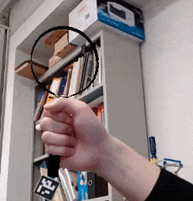
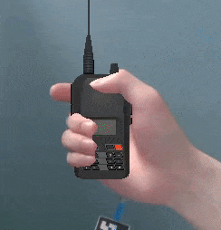
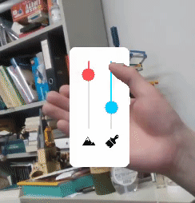

# GrabAR: Occlusion-aware Grabbing Virtual Objects in AR

<figure class="third">
    
</figure>

## Introduction

This repo is an official **[PyTorch](https://pytorch.org/)** implementation of [**GrabAR: Occlusion-aware Grabbing Virtual Objects in AR**](https://wbstx.github.io/grabar/).

